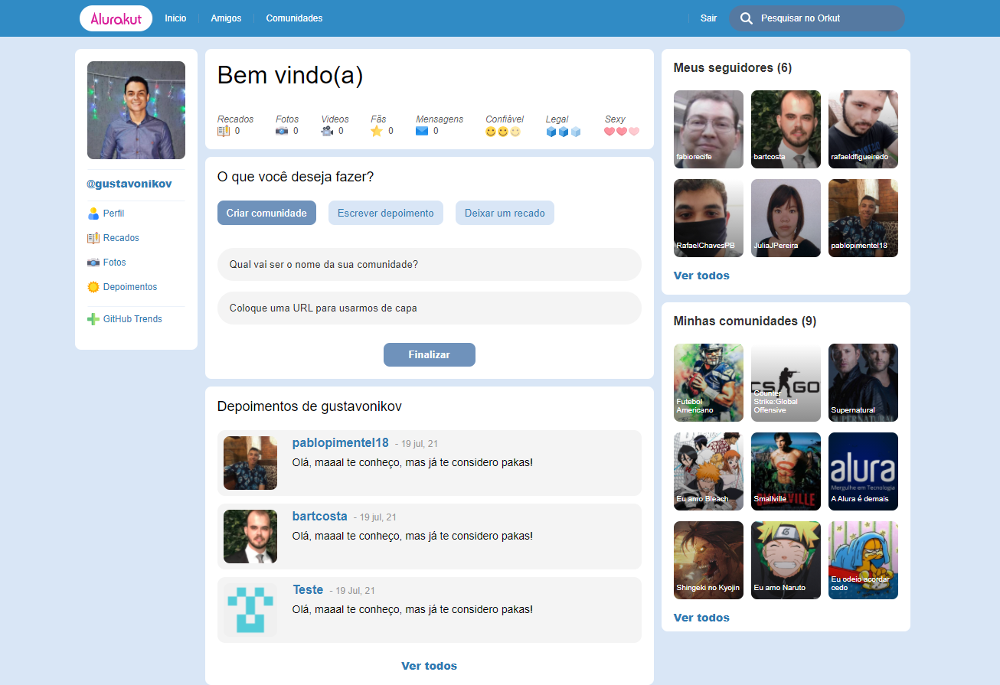

# Alurakut :)

## Purpose

App made at Alura's React Imersion #03, it is a remake of the famous Google App 'Orkut', that is very nostalgic and cool :D, check it out!

## Getting Started

You can use git clone to copy this repository by typing this command on your console:
`` https://github.com/gustavonikov/alurakut.git ``
or you can download the zip file and open it in your IDE.

Then you run ```npm install``` if you have npm installed on your machine or ```yarn add``` if you have yarn,
to install all the dependencies that are necessarily to run the project.

### DatoCMS

To use the app, you must create an account on [DatoCMS](https://www.datocms.com/).

After the account has been made, you must then create the following models:
<br>
#### Model 1 - Community

That must have the following fields:
  <li>Title</li>
  <li>Image URL</li>
  <li>Slug Creator</li>

#### Model 2 - Testimonial

That must have the following fields:
  <li>Testimonial Author</li>
  <li>Testimonial Text</li>
  <li>Testimonial Date</li>
<br>

When you finish, you now have to set the environment variables with the Tokens from DatoCMS.
The env_example file contains the names, you just have to replace the 'YOUR_TOKEN' with your token from DatoCMS.
The tokens can be found on Api Tokens on the Sidebar of DatoCMS.

<br>

After install the necessarily packages and make the configuration of DatoCMS correctly, run the development server, 
that by default will open on http://localhost:3000, running the following commands:
<br>

```bash
npm run dev
# or
yarn dev
```

## Main Tools
<li>ReactJs</li>
<li>NextJs</li>
<li>Styled-Components</li>
<li>DatoCms</li>
<li>Nookies</li>
<li>Date-fns</li>

<br/>

### Homepage


